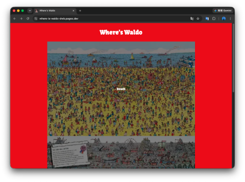
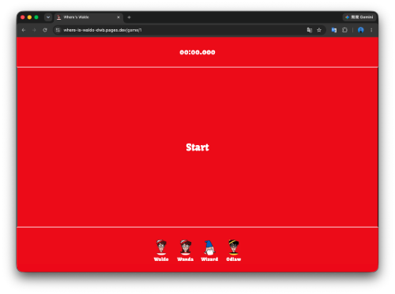
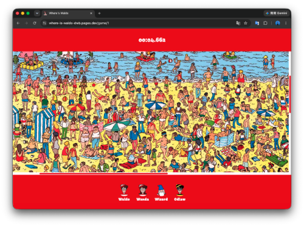
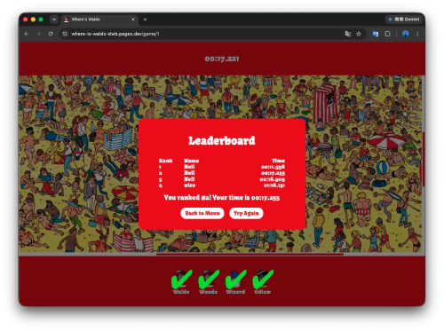

# 📙Where's Waldo

[🔗 點此訪問網站](https://where-is-waldo-dwb.pages.dev/)

這是一個基於 React 構建威利在哪裡的遊戲，整合了 Cloudflare R2 圖片儲存與 Railway 後端 API，提供流暢的遊戲與互動體驗。

## 🛠 技術棧

- Frontend: React + Vite
- Styling: CSS module

## ✨核心特色

- 響應式設計：支援手機、平板與桌機，提供最佳遊戲體驗。
- 圖片加載偵測：遊戲圖片資源比較大，會在圖片加載完成後才允許開始遊戲，以維持遊戲公平。
- 防作弊：將遊戲開始時間跟已尋找到的目標存在後端session，並在後端檢查遊戲進度。
- 座標式互動：遊戲中會把使用者點擊的座標依據當前畫布跟整張畫布比例，換算成整張畫布的百分比座標。

## 📁 專案結構

```
public              # 靜態資源（不經過 Vite 編譯）
src
├── assets          # 靜態資源 （會經過 Vite 編譯）
├── components      # UI 元件
├── pages           # 頁面級元件
├── main.jsx        # 渲染起點
├── routes.jsx      # 路由配置
├── App.css         # 應用程式入口 
└── App.jsx         # 全局樣式設定
```

## 📸 界面展示 (Screenshots)

主頁面



起始頁面



遊戲畫面



排行榜



## 🔑 環境變數設定（.env）

請在根目錄建立 .env 並參考以下設定：

```
# VITE_API_BASE_URL='http://localhost:3000/api'
```

## 🚀 快速啟動

1. 安裝依賴
```
npm install
```

2. 啟動專案
```
npm run dev
```
